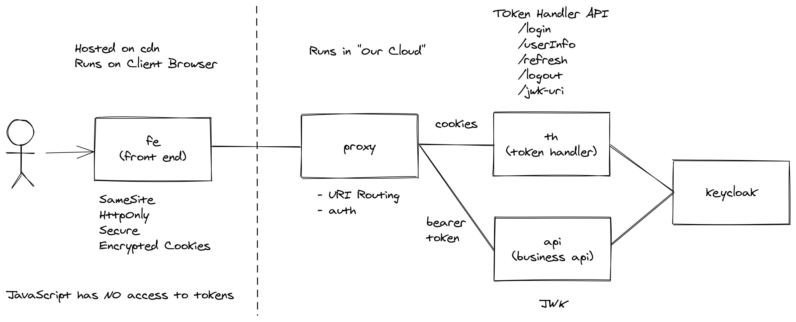
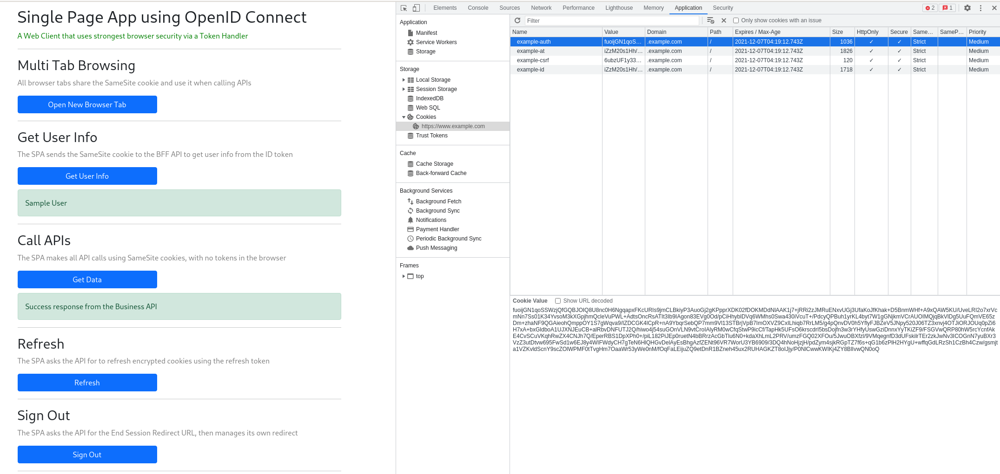

# 🔐 quarkus-token-handler 🔐

SPA using Keycloak, OIDC, OAuth2, FAPI, Encrypted Cookies.

- https://curity.io/resources/learn/the-token-handler-pattern
- https://www.pingidentity.com/en/company/blog/posts/2021/refresh-token-rotation-spa.html

An re-implementation using Quarkus and Keycloak based on the the fantastic curity.io examples. 👏👏



SPA (single page apps) use access tokens that grant access to backend resources. SPA's are run in an insecure environment (the user's browser) and can be served off of CDN hosting. The risk of Token attacks is high e.g. XSS from malicious javascript code stealing tokens.

Modern browsers offer ways to secure cookies and limit their usage to secure HTTPS traffic only (thus inaccessible to scripts or insecure traffic). By setting `SameSite=strict` we can limit requests from only the originating domain. CORS headers are set to further limit CSRF attacks. Content Security Policy headers are set to block malicious code from sending requests outside the app.

The only way to protect tokens from being accessed by any malicious code is to keep them away from the browser. Tokens are encrypted and stored on the client using `SameSite, HttpOnly, Secure` cookies. This is stateless from a backend perspective (cookies are not stored on the server side). The `Token Handler Pattern` is a back-end-for-frontend approach. All communication from the front end goes through the token handler. The token handler is made up of two apps. The handler itself communicates to the identity service (Keycloak) using signed client secrets (JARM) and Pushed Authentication requests (PAR). These include PKCE and other best in breed Oauth2.0 practices. The business api call is proxied through to the backend application, converting the cookie to a bearer token which is checked against the JWK auth endpoint.

In this example the Keycloak client (`bff_client`) is conformant to security standards and profiles set at the realm level - i.e. Financial-grade API baseline and advanced `Policy` is met (with one exception - we disable holder-of-key enforcer i.e mTLS clients - which is a WIP).



## Certificate Setup

Token Handler and Proxy needs SSL Certificates generated
```bash
cd test/certs
./create-certs.sh
cp example.server.p12 ../../th/src/main/resources/
cp example.client.p12 ../../th/src/main/resources/
cp example.ca.pem ../../keycloak/
cp example.server.pem ../../proxy/src/main/resources/
cp example.server.key ../../proxy/src/main/resources/
cp example.server.p12 ../../fe/webhost/
```

Load the CA `example.ca.pem` into your Web Browser trust store for demoing.

Generate bff-client JWT certs
```bash
cd test/certs
GO111MODULE=off go get github.com/lestrrat-go/jwx/cmd/jwx
jwx jwk generate --type RSA --keysize 2048 --template '{"alg":"PS256","use":"sig"}' > private.key
jwx jwk format --public-key private.key > public.key
cp private.key ../../th/src/main/resources/
echo '{"keys":['`cat public.key`']}'| jq . > public-jwk.key
cp public-jwk.key ../../th/src/main/resources/
```

After Keycloak has started, put its self-signed cert into a keystore:
```bash
cd th
keytool -genkey -alias secure-server -storetype PKCS12 -keyalg RSA -keysize 2048 -keystore keystore.p12 -validity 3650 -dname "CN=DEV, OU=DEV, O=ACME, L=Brisbane, ST=QLD, C=AU" -storepass password
openssl s_client -showcerts -connect localhost:8443 </dev/null 2>/dev/null | awk '/BEGIN CERTIFICATE/,/END CERTIFICATE/ {print $0}' > /tmp/kc.pem
keytool -trustcacerts -keystore keystore.p12 -storepass password -importcert -alias login.example.com -file "/tmp/kc.pem" -noprompt
keytool -list -keystore keystore.p12 -storepass password -noprompt
```

## Running Locally

Keycloak
```bash
cd keycloak
podman-compose -t hostnet up -d
```

Login to Keycloak admin web console and Add a new realm using `keycloak/bff-openid-code-grant-realm.json` file.

Run the Proxy
```bash
cd proxy
mvn quarkus:dev -Ddebug=5006
```

Build the Front End
```bash
cd fe/spa
npm run build
```

Run the example Front End
```bash
cd fe/webhost
npm run start
```

Run the example Business API
```bash
cd be/api
npm run start
```

Run the Token Handler
```bash
cd th
# we need the truststore for JARM (jwt validation)
mvn clean quarkus:dev -Djavax.net.ssl.trustStore=keystore.p12 -Djavax.net.ssl.trustStorePassword=password
```

Run the Test suite
```bash
cd test
./test-token-handler.sh
>>> 🌈 TESTING COMPLETED OK 🌈
```

## Deploy to OpenShift

🐑 WIP - these steps will get automated into Helm, eventually. 🐑

1. Clone the repo and run the `Certificate Setup` steps from above

```bash
git clone https://github.com/eformat/quarkus-token-handler.git && cd quarkus-token-handler
```

```bash
# Certificate Setup steps
cd test/certs
./create-certs.sh
cp example.server.p12 ../../th/src/main/resources/
cp example.client.p12 ../../th/src/main/resources/
cp example.ca.pem ../../keycloak/
cp example.server.pem ../../proxy/src/main/resources/
cp example.server.key ../../proxy/src/main/resources/
cp example.server.p12 ../../fe/webhost/
go get github.com/lestrrat-go/jwx/cmd/jwx
jwx jwk generate --type RSA --keysize 2048 --template '{"alg":"PS256","use":"sig"}' > private.key
jwx jwk format --public-key private.key > public.key
cp private.key ../../th/src/main/resources/
echo '{"keys":['`cat public.key`']}'| jq . > public-jwk.key
cp public-jwk.key ../../th/src/main/resources/
```

2. Login to OpenShift as a cluster-admin, create `token-handler` Project, Keycloak Operator, Keycloak instance, Applications. You may need to run it twice if CRD's for Keycloak not present in your cluster (wait for subscription).

```bash
cd quarkus-token-handler
oc apply -k deploy/dev
oc project token-handler
```

Wait till keycloak pod is running.

```bash
oc wait pod -l app=keycloak --for=condition=Ready --timeout=300s
```

3. Deploy the four app charts. For now we will use the default configuration which we will update in later steps.

```bash
helm upgrade --install fe fe/chart/ --namespace token-handler
helm upgrade --install th th/chart/ --namespace token-handler
helm upgrade --install api be/api/chart/ --namespace token-handler
helm upgrade --install proxy proxy/chart/ --namespace token-handler
```

4. Load `keycloak/bff-openid-code-grant-realm.json` bff realm into keycloak using the `Add Realm` -> `import from file` function. Login to Keycloak with the `admin` user credential:

```bash
# Keycloak URL
echo https://$(oc -n token-handler get route keycloak -o custom-columns=ROUTE:.spec.host --no-headers)
# login using admin and this password
oc -n token-handler get secret credential-keycloak -o=jsonpath='{.data.ADMIN_PASSWORD}' | base64 -d; echo
```

5. Under the `bff` realm -> `bff_client` client `Settings` - edit and replace the `Valid Redirect URIs`, `Web Origins` with Front End route url:

```bash
echo https://$(oc -n token-handler get route -l app.kubernetes.io/component=quarkus-token-handler-front-end -o custom-columns=ROUTE:.spec.host --no-headers)
```

and `Save`.

6. Under `bff_client` client `Keys` - edit and replace the `Keys JWKS URL` with the Token Handler route:

```bash
echo https://$(oc -n token-handler get route -l app.kubernetes.io/component=quarkus-token-handler -o custom-columns=ROUTE:.spec.host --no-headers)/tokenhandler/jwk
```

and `Save`.

7. Patch the Front End Route to be reencrypt:

```bash
oc -n token-handler patch route/fe-quarkus-token-handler-front-end -p "
spec:
  tls:
    termination: Reencrypt
    insecureEdgeTerminationPolicy: Redirect
    destinationCACertificate: |-
$(sed 's/^/      /' test/certs/example.ca.pem)
"
```

8. Set the Front End application configuration files in the container:

```bash
PROXY_ROUTE=https://$(oc -n token-handler get route -l app.kubernetes.io/component=quarkus-token-handler-proxy -o custom-columns=ROUTE:.spec.host --no-headers)
```

```bash
cat << EOF > /tmp/config.json
{
    "port": 8443,
    "apiBaseUrl": "$PROXY_ROUTE",
    "keystoreFilePath": "example.server.p12",
    "keystorePassword": "password"
}
EOF
oc -n token-handler delete cm fe-config
oc -n token-handler create configmap fe-config --from-file=/tmp/config.json
oc -n token-handler set volume deployment/fe-quarkus-token-handler-front-end \
  --add --overwrite -t configmap --configmap-name=fe-config --name=fe-config \
  --mount-path=/usr/webhost/config.json --sub-path=config.json \
  --overwrite --default-mode='0777' --read-only=true
```

```bash
cat << EOF > /tmp/config.json
{
    "businessApiBaseUrl": "${PROXY_ROUTE}/api",
    "oauth": {
        "tokenHandlerBaseUrl": "${PROXY_ROUTE}/tokenhandler"
    }
}
EOF
oc -n token-handler delete cm fe-content-config
oc -n token-handler create configmap fe-content-config --from-file=/tmp/config.json
oc -n token-handler set volume deployment/fe-quarkus-token-handler-front-end \
  --add --overwrite -t configmap --configmap-name=fe-content-config --name=fe-content-config \
  --mount-path=/usr/webhost/content/config.json --sub-path=config.json \
  --overwrite --default-mode='0777' --read-only=true
```

```bash
oc -n token-handler delete secret fe-server-cert
oc -n token-handler create secret generic fe-server-cert --from-file=test/certs/example.server.p12
oc -n token-handler set volume deployment/fe-quarkus-token-handler-front-end \
  --add --overwrite -t secret --secret-name=fe-server-cert --name=fe-server-cert \
  --mount-path=/usr/webhost/example.server.p12 --sub-path=example.server.p12 --overwrite \
  --default-mode='0777' --read-only=true
```

9. Redeploy Token Handler with appropriate helm chart values set:


```bash
# set env vars
KEYCLOAK_ROUTE=https://$(oc -n token-handler get route keycloak -o custom-columns=ROUTE:.spec.host --no-headers)
KEYCLOAK_SECRET="1cd70bdf-db5b-4346-83da-babe16dae1d8" # needs to match keycloak/bff-openid-code-grant-realm.json
FE_ROUTE=https://$(oc -n token-handler get route -l app.kubernetes.io/component=quarkus-token-handler-front-end -o custom-columns=ROUTE:.spec.host --no-headers)
CSP=$(echo *.$(oc get ingress.config/cluster -o 'jsonpath={.spec.domain}'))
COOKIE_DOMAIN=$(echo .$(oc get ingress.config/cluster -o 'jsonpath={.spec.domain}'))
TRUST_STORE_PASSWORD="password"
# random values
ENC_KEY=$(openssl rand -hex 16)
SALT=$(openssl rand -hex 16)
IV_KEY=$(openssl rand -hex 8)
```

```bash
# redeploy token handler chart
helm upgrade --install th th/chart/ \
  --set keycloak.url="${KEYCLOAK_ROUTE}" \
  --set keycloak.clientSecret="${KEYCLOAK_SECRET}" \
  --set frontend.url="${FE_ROUTE}" \
  --set csp="${CSP}" \
  --set trustStorePwd="${TRUST_STORE_PASSWORD}" \
  --set trustedWebOrigins="${FE_ROUTE}" \
  --set redirectUri="${FE_ROUTE}" \
  --set encKey="${ENC_KEY}" \
  --set salt="${SALT}" \
  --set ivKey="${IV_KEY}" \
  --set cookieDomain="${COOKIE_DOMAIN}" \
  --set javaOptions="-Dquarkus.http.host=0.0.0.0 -Djava.util.logging.manager=org.jboss.logmanager.LogManager -Djavax.net.ssl.trustStore=/var/run/secrets/keystore.p12 -Djavax.net.ssl.trustStorePassword=${TRUST_STORE_PASSWORD}"
```

10. Set up secrets for Token Handler:

```bash
# private key for JARM
oc -n token-handler delete secret th-private-key
oc -n token-handler create secret generic th-private-key --from-file=test/certs/private.key
oc -n token-handler set volume deployment/th-quarkus-token-handler \
  --add --overwrite -t secret --secret-name=th-private-key --name=th-private-key \
  --mount-path=/var/run/secrets/private.key --sub-path=private.key --overwrite \
  --default-mode='0777' --read-only=true
# public key for JARM
oc -n token-handler delete secret th-public-key
oc -n token-handler create secret generic th-public-key --from-file=test/certs/public-jwk.key
oc -n token-handler set volume deployment/th-quarkus-token-handler \
  --add --overwrite -t secret --secret-name=th-public-key --name=th-public-key \
  --mount-path=/var/run/secrets/public-jwk.key --sub-path=public-jwk.key --overwrite \
  --default-mode='0777' --read-only=true
```

```bash
# generate trust store for keycloak
TRUST_STORE_PASSWORD="password"
keytool -genkey -alias secure-server -storetype PKCS12 -keyalg RSA -keysize 2048 -keystore /tmp/keystore.p12 -validity 3650 -dname "CN=DEV, OU=DEV, O=ACME, L=Brisbane, ST=QLD, C=AU" -storepass ${TRUST_STORE_PASSWORD}
openssl s_client -showcerts -connect $(oc -n token-handler get route keycloak -o custom-columns=ROUTE:.spec.host --no-headers):443 </dev/null 2>/dev/null | awk '/BEGIN CERTIFICATE/,/END CERTIFICATE/ {print $0}' > /tmp/kc.pem
keytool -trustcacerts -keystore /tmp/keystore.p12 -storepass ${TRUST_STORE_PASSWORD} -importcert -alias login.example.com -file "/tmp/kc.pem" -noprompt
# load into secret
oc -n token-handler delete secret th-trust-store
oc -n token-handler create secret generic th-trust-store --from-file=/tmp/keystore.p12
oc -n token-handler set volume deployment/th-quarkus-token-handler \
  --add --overwrite -t secret --secret-name=th-trust-store --name=th-trust-store \
  --mount-path=/var/run/secrets/keystore.p12 --sub-path=keystore.p12 --overwrite \
  --default-mode='0777' --read-only=true
```

11. Set up configuration for API:

```bash
FE_ROUTE=https://$(oc -n token-handler get route -l app.kubernetes.io/component=quarkus-token-handler-front-end -o custom-columns=ROUTE:.spec.host --no-headers)
KEYCLOAK_ROUTE=https://$(oc -n token-handler get route keycloak -o custom-columns=ROUTE:.spec.host --no-headers)/auth/realms/bff/protocol/openid-connect/certs
cat << EOF > /tmp/config.json
{
    "port": 8080,
    "trustedWebOrigin": "${FE_ROUTE}",
    "jwksUrl": "${KEYCLOAK_ROUTE}"
}
EOF
oc -n token-handler delete cm api-config
oc -n token-handler create configmap api-config --from-file=/tmp/config.json
oc -n token-handler set volume deployment/api-quarkus-token-handler-api \
  --add --overwrite -t configmap --configmap-name=api-config --name=api-config \
  --mount-path=/usr/api/config.json --sub-path=config.json --overwrite \
  --default-mode='0777' --read-only=true
```

12. Set up Proxy:

```bash
helm upgrade --install proxy proxy/chart/ \
  --set encKey="${ENC_KEY}" \
  --set salt="${SALT}" \
  --set ivKey="${IV_KEY}"
```
